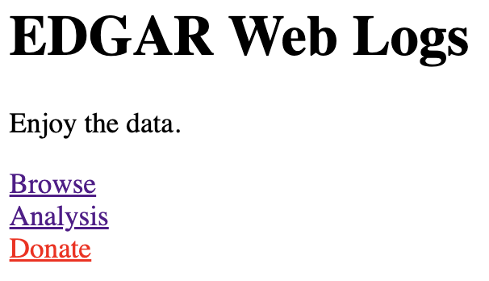
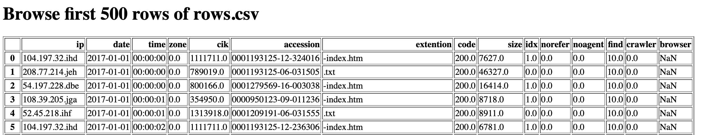
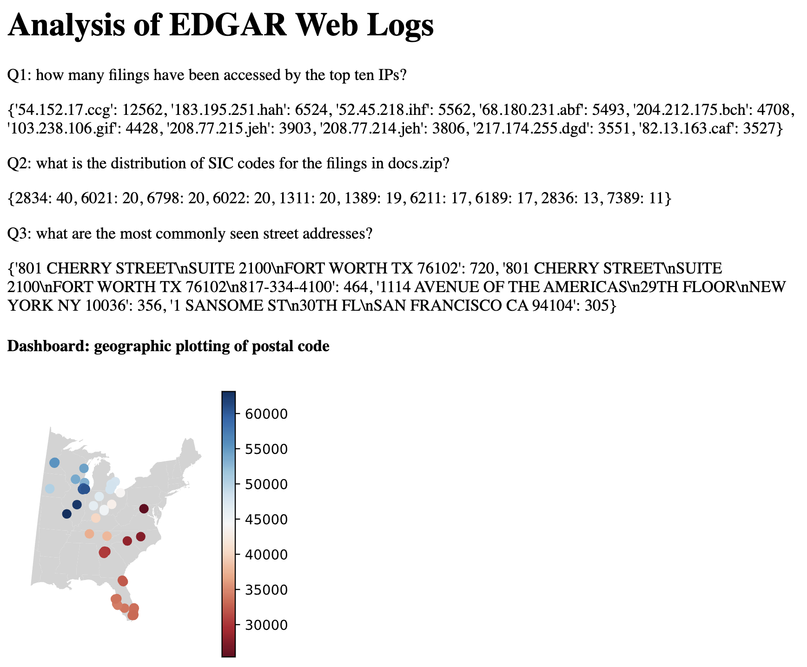

# Project 4: Building a Website Sharing EDGAR Web Logs 

## Overview

In the US, public companies need to regularly file
various statements and reports to the SEC's (Securities and Exchange
Commission) EDGAR database.  EDGAR data is publicly available online;
furthermore, web requests to EDGAR from around the world are logged
and published.  EDGAR logs are huge.  Logs for *just one day* might be
about 250 MB compressed as a .zip (or 2 GB uncompressed!).

We'll develop tools to extract information from the filings stored in EDGAR 
(this will be done in a Python module, `edgar_utils.py`). 

We'll also use the flask framework to build a website that displays the analysis 
of user behavior. The website will have the following features:  
 
(1) **a link** to a donation page that is optimized via A/B testing,  
(2) **a page** within the website that displays the data in `html` and `JSON` format,  
(3) **a page** within the website that displays analysis and plots of the data, 
(4) **a homepage page**.

## Data Format
Take a look at the list of daily zips and CSV documentation on the EDGAR site:

- https://www.sec.gov/dera/data/edgar-log-file-data-set.html
- https://www.sec.gov/files/EDGAR_variables_FINAL.pdf


## Pages

Your web application should include three pages:
* `index.html`
* `browse.html`
* `donate.html`
* `analysis.html`

To get started, consider creating a basic `index.html` file:

```html
<html>
  <body>
    <h1>EDGAR Web Logs</h1>

    <p>Enjoy the data.</p>
  </body>
</html>
```

Then create a simple flask app in `main.py` with a route for the homepage that loads `index.html`

Requirements:

* Going to `http://your-ip:port/browse.html` should return the content for `browse.html`, and similarly for the other pages.
* The index.html page should have hyperlinks to all the other pages.  Be sure to not include your IP here! A relative path is necessary to pass our tests.
* You should put whatever content you think makes sense on the pages.  Just make sure that they all start with an `<h1>` heading, giving the page a title.

Your home page should look like this:



## Part 1: Browse Page

The `browse.html` page should show an HTML table of the first **500** rows of
`rows.csv` from `server_log.zip`.  

The page should look like this:



### Rate Limiting JSON Page

JSON files are used to transmit structured data over network
connection.  Add a resource at `https://your-ip:port/browse.json` that
displays the same information as `browse.html`, but in JSON format
(represent the DataFrame as a list of dicts, such that each dict
corresponds to one row).

Check the client IP with `request.remote_addr`.  Do not allow more
than one request per minute from any one IP address.


### IP visitors of JSON Page
Now add a resource at `http://your-ip:5000/visitors.json` that returns a list of 
the IP addresses that have visited your `browse.json` resource.

## Part 2: Donations

On your donations page, write some text, making your best plea for
funding. Then, let's find the best design for the homepage, so that
it's more likely for the testers to click the link to the donations page.

We'll do an A/B test.  Create two versions of the homepage, say, A and B.
They should differ in some way, perhaps somewhat trivially (e.g., maybe the link
to donations is blue in version A and in red in version B).

For the first 10 times your homepage is visited, alternate between version
A and B each time.  After that, pick the best version (the one where
people click to donate most often), and keep showing it for all future
visits to the page.

## Part 3: creating `edgar_utils.py` module


# Part 4
On your Analyze page, display some analysis and a plot of the EDGAR Web Logs in the format of:

```
<p>Q1: how many filings have been accessed by the top ten IPs?</p>
<p>???</p>
<p>Q2: what is the distribution of SIC codes for the filings in docs.zip?</p>
<p>???</p>
<p>Q3: what are the most commonly seen street addresses?</p>
<p>???</p>
<h4>Dashboard: geographic plotting of postal code</h4>
```

The result should look like this:



### Q1: how many filings have been accessed by the top ten IPs?

Answer with a dictionary, with the (anonymized) IP as key and the number of requests seen in `server_log.zip` as the values. Each row in the logs corresponds to one request. Note that the anonymized IP addresses are consistent between requests.

### Q2: what is the distribution of SIC codes for the filings in `docs.zip`?

Read the HTML from this file and use it to create a `Filing` object, from which you can access the `.sic` attribute.


### Q3: what are the most commonly seen street addresses?

For each request ("cik/accession/extention") in the `server_log.zip` that has a corresponding 
filing in `docs.zip`, count each of the addresses for that filing. 
(ignore rows in the logs which refer to pages not in `docs.zip`).

Show a dictionary of counts for all addresses appearing at least 300
times.

### Dashboard: geographic plotting of postal code

The `locations.geojson` contains the positions of some of the
addresses in the dataset.  Plot this over the background map in
"shapes/cb_2018_us_state_20m.shp"

Additional requirements:

* crop to the following lat/lon bounds:

```python
west = -95
east = -60
north = 50
south = 25
```

* use a Mercator projection, "epsg:2022"
* the color of each point should indicate the postal code. For example, the postal code of `245 SUMMER STREET\nBOSTON MA 02210` is `2210`. If it's in the form like `53705-1234`, only take `53705`. If it's neither 5 digits number nor 9 digits number, don't use the point.
* only show the street with a postal code from 25000 to 65000
* use the "RdBu" colormap, with a colorbar
* the color of background is "lightgray"

Finally, display this plot on your homepage in the SVG format via a flask route. 

