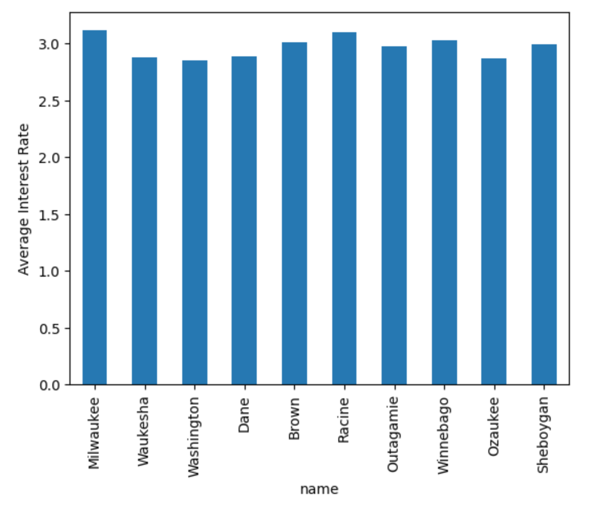

# P5: Spark, Loan Applications

## Overview

In P5, we'll use Spark to analyze loan applications in WI.  You'll
load your data to Hive tables and views so you can easily query them.
The big table (loans) has many IDs in columns; you'll need to join
these against other tables or views to determine the meaning of these
IDs.  In addition, you'll practice training a Decision Tree model to
predict loan approval.

Learning objectives:

* use Spark's RDD, DataFrame, and SQL interfaces to answer question about data
* load data into Hive for querying with Spark
* optimize queries with bucketing and caching
* train a Decision Tree model

## Cluster Setup

### Containers

For this project, you'll deploy a small cluster of containers:

* `p5-nb` (1 Jupyter container)
* `p5-nn` (1 NameNode container)
* `p5-dn` (1 DataNode container)
* `p5-boss` (1 Spark boss container)
* `p5-worker` (2 Spark worker containers)

## Data Setup

### Virtual Machine

The Docker Compose setup maps a	`nb` directory into your Jupyter
container.  Within `nb`, you need to create a subdirectory called
`data` and fill it with some CSVs you'll use for the project.


### Jupyter Container

Connect to JupyterLab inside your container, and create a notebook
called `p5.ipynb`.  Put your name(s) in a comment at the top.

## Part 1: Filtering: RDDs, DataFrames, and Spark

Inside your `p5.ipynb` notebook, create a Spark session (note we're enabling
Hive on HDFS):

```python
from pyspark.sql import SparkSession
spark = (SparkSession.builder.appName("cs544")
         .master("spark://boss:7077")
         .config("spark.executor.memory", "512M")
         .config("spark.sql.warehouse.dir", "hdfs://nn:9000/user/hive/warehouse")
         .enableHiveSupport()
         .getOrCreate())
```

#### Q1: how many banks contain the word "first" in their name, ignoring case?  Use an **RDD** to answer.

#### Q2: how many banks contain the word "first" in their name, ignoring case?  Use a **DataFrame** to answer.

This is the same as Q1, but now you must operate on `banks_df` itself,
without directly accessing the underlying `RDD`.

#### Q3: how many banks contain the word "first" in their name, ignoring case?  Use **Spark SQL** to answer.

## Part 2: Hive Data Warehouse

#### `loans` table

You have already added a `banks` table to Hive (using the command we
shared with you).

Now, write similar code `hdma-wi-2021.csv` into a table called
`loans`.

#### Q4: what tables are in our warehouse?

You can use `spark.sql("SHOW TABLES").show()` to see your tables in the warehouse as follows. 

```
+---------+-------------+-----------+
|namespace|    tableName|isTemporary|
+---------+-------------+-----------+
|  default|        banks|      false|
|  default|        loans|      false|
|         | action_taken|       true|
|         |     counties|       true|
|         |denial_reason|       true|
|         |    ethnicity|       true|
|         | loan_purpose|       true|
|         |    loan_type|       true|
|         |  preapproval|       true|
|         |property_type|       true|
|         |         race|       true|
|         |          sex|       true|
|         |       states|       true|
|         |       tracts|       true|
+---------+-------------+-----------+
```
Answer with a Python dict


#### Q5: how many loan applications has the bank "University of Wisconsin Credit Union" received in 2020 in this dataset?

#### Q6: what does `.explain("formatted")` tell us about how Spark executes Q5?

Show the output, then write comments (which we will manually grade) explaining the following:

1. Which table is sent to every executor via a `BroadcastExchange` operation?
2. Does the plan involve `HashAggregate`s (depending on how you write the query, it may or may not)?  If so, which ones?

## Part 3: Grouping Rows

#### Q7: what are the average interest rates for Wells Fargo applications for the ten counties where Wells Fargo receives the most applications?

Answer with a Python `dict`

The cell following your answer should have a plot that looks like this:



#### Q8: when computing a MEAN aggregate per group of loans, under what situation (when) do we require network I/O between the `partial_mean` and `mean` operations?

If a network transfer (network I/O) is necessary for one query but not the other, write a comment explaining why.  

## Part 4: Machine Learning

The objective of Part 4 is to use the given loan dataset to train a
Decision Tree model that can predict outcomes of loan applications
(approved or not). Recall that a loan is approve if `action_taken` is
"Loan originated".

We call our label `approval`, indicating the whether of a loan
application is approved or not (`1` for approved, `0` otherwise). And
for this exercise, we will use the features `loan_amount`, `income`,
`interest_rate` in `loans` table for prediction.

First, as a prepartory step, get the features and label from the loans
table into a new dataframe `df`. Cast the `loan_amount` and `income`
columns to `double` type and fill missing values by 0.0.

Then split `df` as follows:

```python
# deterministic split
train, test = df.randomSplit([0.8, 0.2], seed=41) 
```

Cache the `train` DataFrame.

#### Q9. How many loans are approved (`approval = 1`) in the `train` DataFrame?

#### Q10. What is the accuracy of the decision tree classifier of depth 5 on the test dataset?

Use the VectorAssembler to combine the feature columns `loan_amount`,
`income`, `interest_rate` into a single column.

Train a `DecisionTreeClassifier` of max depth 5 (and default arguments
for other parameters) on your training data to predict `approved`
based on the features.